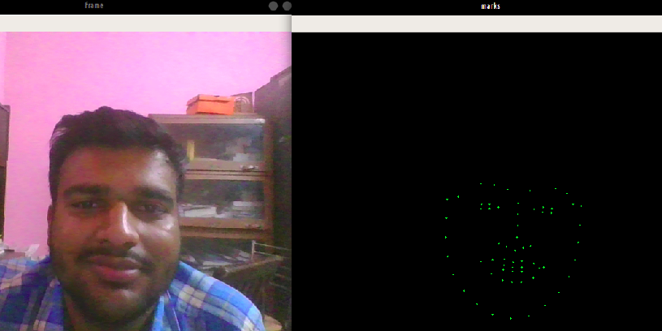

# Face LandMarks Identification

## With the help of dlib we can figure out the 68 landmarks on face which shows

1. ###  Mouth, (48, 68)
2. ### Right Eyebrow, (17, 22)
3. ### Left Eyebrow, (22, 27)
4. ### Right Eye, (36, 42)
5. ### Left Eye, (42, 48)
6. ### Nose, (27, 36)
7. ### Jaw, (0, 17)

This Notebook Captures the live video and plots all the 68 points seprately.

### Furthermore it can be used to perform more face intensive tasks

